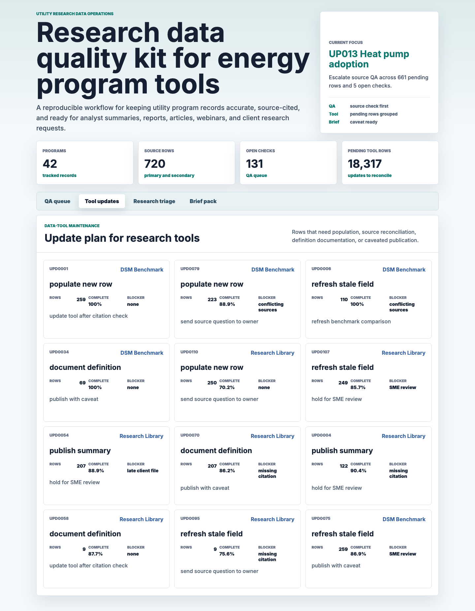
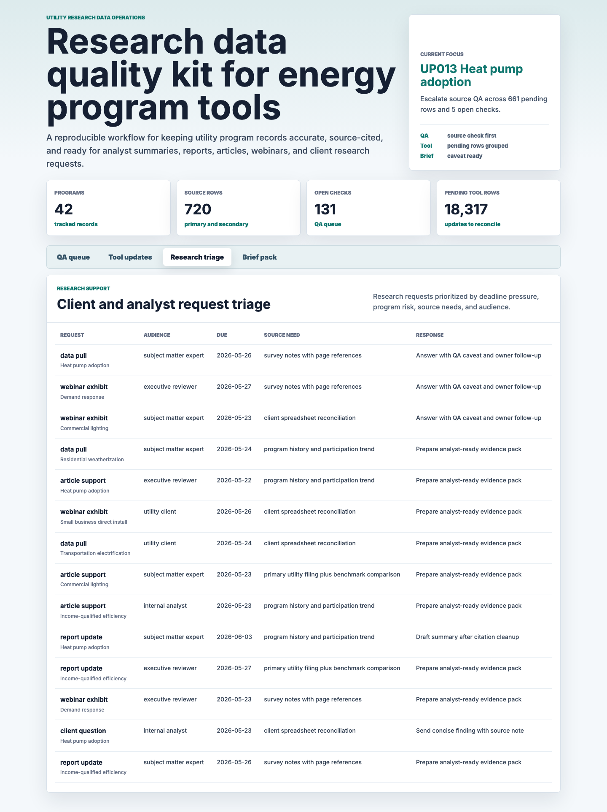

# Utility Energy Research Data Quality Kit

An interactive portfolio artifact for a utility research, advisory, and data tools team that needs accurate energy program records, source-cited research support, and clear stakeholder summaries. The kit turns synthetic utility program data, source observations, quality checks, research requests, and tool update tasks into a repeatable operating workflow.

## What this project demonstrates

This project is built for a data analyst intern workflow in the utility and energy-efficiency research domain. It shows how to:

- Populate and refresh data tools with traceable source evidence.
- Organize primary and secondary research observations.
- Use SQL-style checks and Python scoring to find stale, incomplete, or risky records.
- Triage client and analyst research requests by deadline, data quality, and source needs.
- Translate the output into concise written and visual summaries for nontechnical reviewers.

## Screenshots


The QA queue ranks utility program records by open checks, stale verification dates, source confidence, citation gaps, and pending data-tool updates.



The update plan converts raw maintenance work into clear next steps for population, source reconciliation, definition documentation, and caveated publication.



The research triage view prioritizes report, article, webinar, data pull, and client-question requests by deadline pressure, source needs, and program quality risk.

## Data

All row-level data is deterministic synthetic data generated by `scripts/score_operating_data.py`. It does not represent any real utility, client, employee, customer, proprietary research tool, or company performance.

The structure is modeled on common utility energy-efficiency and demand-side-management reporting patterns, plus research operations workflows where analysts maintain program records, compare source evidence, document definitions, and answer stakeholder requests. Synthetic data is used because real utility filings, client questions, tool records, and analyst notes would be proprietary or client-specific.

The generator uses a fixed random seed and an as-of date of `2026-05-26` so the artifact can be reproduced exactly. Program records are distributed across North American regions, electric, gas, dual-fuel, municipal, and cooperative utilities, and common DSM program areas such as weatherization, commercial lighting, demand response, heat pump adoption, income-qualified efficiency, transportation electrification, and small business direct install.

Key assumptions in the synthetic layer:

- Program completeness is centered around 84 percent with bounded variation, so the queue includes clean records, watchlist records, and records that need immediate follow-up.
- Source confidence varies by source type. Utility filings and benchmark studies receive a small confidence lift, while web research is more likely to need confirmation.
- Citation status is weighted toward complete citations, with a smaller share needing page references or missing citation cleanup.
- Quality check severity is weighted toward medium and high issues, with critical issues included to test escalation logic.
- Research request due dates range from overdue to 30 days out, which lets the triage logic balance deadline pressure against data quality risk.
- Data-tool update blockers include missing citations, subject-matter expert review, conflicting sources, and late client files.

Generated source tables:

- `data/utility_programs.csv`: 42 utility program records with region, utility type, program area, data tool, completeness, savings, participation, and last verification metadata.
- `data/source_observations.csv`: 720 primary and secondary source observations with confidence scores, citation status, field names, normalized values, and analyst notes.
- `data/quality_checks.csv`: 180 data quality checks covering stale values, missing citations, unit conversions, definition mismatches, duplicate rows, and benchmark outliers.
- `data/research_requests.csv`: 96 stakeholder requests for client questions, reports, articles, webinars, and data pulls.
- `data/data_tool_updates.csv`: 136 maintenance tasks for population, reconciliation, definition review, stale-field refreshes, and summary publication.

Generated analysis outputs:

- `analysis/outputs/program_quality_queue.csv`
- `analysis/outputs/tool_update_plan.csv`
- `analysis/outputs/research_request_triage.csv`
- `analysis/outputs/stakeholder_brief_pack.csv`
- `analysis/outputs/app_payload.json`

## Analysis Logic

The Python workflow scores each program using:

- Data-tool completeness and pending update volume.
- Open quality checks, severity, and affected records.
- Missing citations and average source confidence.
- Days since the last verification date.
- Research request urgency and audience context.

The output is designed to support action, not just reporting. Each ranked row includes a recommended next step such as escalating source QA, resolving update blockers, refreshing stale fields, validating citations, or publishing with a caveat.

## Role Relevance

This artifact mirrors the work of a data analyst intern supporting utility energy research and data tools. It shows attention to detail in data entry and manipulation, basic Python analysis, SQL validation thinking, research organization, and clear communication for nontechnical stakeholders.

The workbench is intentionally built as an operating workflow instead of a standalone chart. It helps answer practical questions an analyst team would face every week:

- Which utility program records should be checked before the next data-tool update?
- Which source observations need citation cleanup or stronger evidence?
- Which client or internal research requests need a caveat before a response is drafted?
- Which findings are ready to turn into a report, article, webinar, or stakeholder summary?

## Run Locally

```bash
npm run analyze
npm start
```

Then open `http://localhost:4873`.

## Scope

This is a static public portfolio artifact with reproducible synthetic data and transparent scoring rules. It does not connect to live utility systems, private research tools, client files, customer records, production BI tools, or proprietary databases. It shows how an analyst can structure data-tool upkeep, QA review, source documentation, request triage, and stakeholder-ready communication in a defensible workflow.
